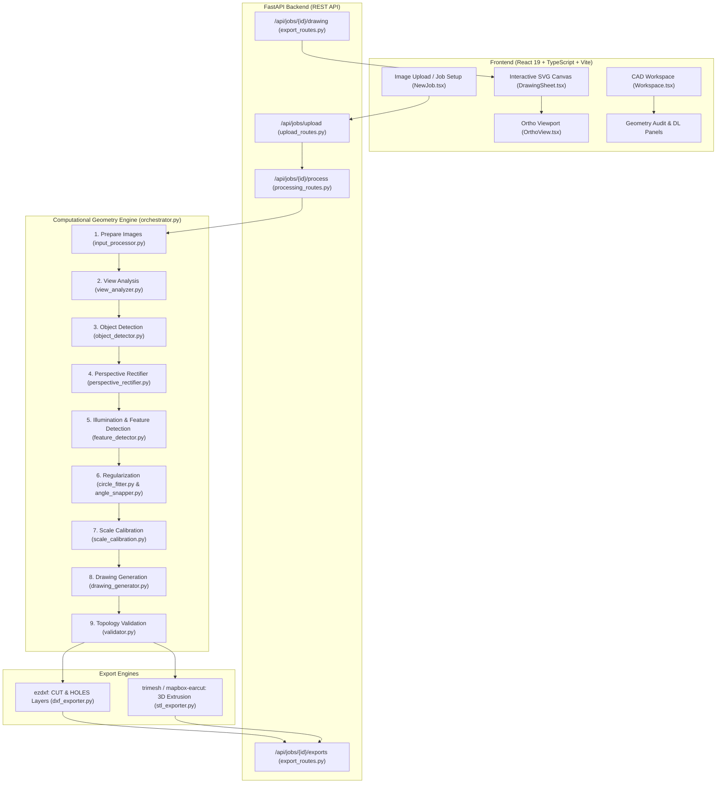

# CADVision AI — Technical Architecture & Developer Reference

> **Authoritative System Reference & Developer Manual**  
> *CADVision AI: Automated Computer Vision Pipeline for Single/Multi-View Photo to CNC-Ready DXF and 3D Watertight STL Reconstruction.*

---

## 1. Executive Summary & System Overview

CADVision AI is an AI-assisted computer vision and computational geometry engine engineered to reverse-engineer physical mechanical flat-parts and sheet metal components directly from photographs or technical orthographic images. It outputs clean, industrial-grade **AutoCAD R2018 DXF** vector drawings and **3D watertight STL** solids ready for CNC laser/plasma cutters, CNC mills, waterjet machines, and 3D printers.

### Core Objectives
1. **Zero Metrology Drift**: Reconstruct true engineering shapes (rectangles, circles, slots, gussets, flanges) from noisy, uncalibrated consumer photographs.
2. **Native CAD Primitives**: Distinguish between true circular holes and freeform contours. Emit true AutoCAD `CIRCLE` entities on a distinct `HOLES` layer rather than segmented, facetted polyline approximations.
3. **Robust Illumination & Sensor Invariance**: Handle uneven lighting, non-uniform background gradients, optical blur, perspective keystoning, and compression noise.
4. **Strict Topological Integrity**: Guarantee valid, non-self-intersecting Shapely geometries, strict boundary containment for inner holes, pairwise hole non-overlap, and standardized winding directions (Counter-Clockwise outer perimeter, Clockwise internal cutouts).
5. **Interactive CAD Review**: Deliver a responsive browser-based CAD canvas featuring dark Blueprint and light Engineering Paper modes, pan/zoom navigation, ISO 7200 title blocks, ISO center crosshairs, and live parametric dimension overlays.

---

## 2. High-Level Architecture & Data Flow



---

## 3. Directory & File Structure

```text
CADVisionAi/
├── .env.example                       # Reference environment variables configuration
├── .gitignore                         # Git ignore rules for virtualenvs, caches, and node_modules
├── README.md                          # Quickstart summary readme
├── README_TECHNICAL.md                # Authoritative developer manual (this document)
├── requirements.txt                   # Backend Python 3.11 frozen dependencies
│
├── backend/                           # Python FastAPI application package
│   ├── main.py                        # Application entrypoint, lifespan manager, CORS & error handlers
│   ├── api/                           # API Route Handlers
│   │   ├── upload_routes.py           # Multi-part file upload & job initialisation endpoints
│   │   ├── processing_routes.py       # Job processing trigger, status polling, cancellation
│   │   └── export_routes.py           # DXF/STL download endpoints and drawing JSON delivery
│   ├── core/                          # Application Configuration & Primitives
│   │   ├── config.py                  # Pydantic BaseSettings (env parsing, thresholds, limits)
│   │   ├── exceptions.py              # Custom typed exception hierarchy (CadAIError subclasses)
│   │   └── logging_config.py          # Structured standard library logging formatter
│   ├── exporters/                     # File Format Writers
│   │   ├── dxf_exporter.py            # AutoCAD R2018 DXF generator (CUT/HOLES layers, CIRCLE entities)
│   │   └── stl_exporter.py            # 3D STL binary triangular mesh generator via earcut/trimesh
│   ├── models/                        # Data Schemas & Job State Definitions
│   │   ├── job_models.py              # Pydantic v2 Job, StageRecord, Dimension, Output models
│   │   └── schemas.py                 # REST API payload & response schemas
│   ├── pipeline/                      # Core Computer Vision & Geometry Reconstruction Pipeline
│   │   ├── orchestrator.py            # Sequential stage dispatcher and job state transition manager
│   │   ├── input_processor.py         # Image decoding, downsampling, and EXIF orientation handling
│   │   ├── view_analyzer.py           # Multi-view quality score, sharpness, and camera angle estimator
│   │   ├── object_detector.py         # Workpiece localization, bounding rect, and component framing
│   │   ├── perspective_rectifier.py   # Keystoning quad detection, tilt measurement & warpPerspective
│   │   ├── feature_detector.py        # Flat-field illumination normalization, contour extraction, sub-pixel corners
│   │   ├── circle_fitter.py           # Kåsa / Pratt algebraic circle fitting and circularity screening
│   │   ├── angle_snapper.py           # Orthogonal cardinal snapping (0/90/180/270°) and collinear segment merging
│   │   ├── scale_calibration.py       # Pixel-to-metric millimeter calibration from known dimensions
│   │   ├── drawing_generator.py       # CAD vector conversion, winding normalization (CCW outer / CW holes)
│   │   └── validator.py               # Strict Shapely topology audits, hole containment, and buffer(0) repairs
│   ├── storage/                       # State Persistence
│   │   ├── job_manager.py             # Atomic JSON file storage for job metadata and stage state
│   │   └── file_manager.py            # Safe disk write and path-traversal prevention helpers
│   └── utils/                         # Mathematics & Geometric Helpers
│       ├── geometry_utils.py          # Polygon AABB extents, axis selection, and scale transforms
│       ├── image_utils.py             # OpenCV matrix conversions and drawing utilities
│       └── video_utils.py             # Frame extraction routines for video inputs
│
├── frontend/                          # Single Page Web Client (React 19 + TypeScript)
│   ├── index.html                     # HTML root template with viewport and title metadata
│   ├── package.json                   # NPM script definitions and JavaScript dependencies
│   ├── tsconfig.json                  # TypeScript compiler settings (strict mode enabled)
│   ├── vite.config.ts                 # Vite bundler configuration and proxy rules
│   └── src/
│       ├── App.tsx                    # React router setup and root application provider
│       ├── main.tsx                   # React DOM bootstrapping and client hydration
│       ├── api/                       # HTTP API Client
│       │   ├── client.ts              # Fetch wrapper with error interception
│       │   ├── jobs.ts                # Job CRUD requests and polling hooks
│       │   └── exports.ts             # DXF/STL download helper triggers
│       ├── components/                # Modular UI Components
│       │   ├── drawing/               # 2D Interactive CAD Canvas
│       │   │   ├── DrawingSheet.tsx   # Pan/zoom canvas, grid renderer, HUD extents, coordinate tracker
│       │   │   ├── OrthoView.tsx      # SVG renderer for outer polylines, crimson holes, ISO crosshairs, CAD dims
│       │   │   ├── TitleBlock.tsx     # ISO 7200 engineering title block overlay
│       │   │   └── DimensionLine.tsx  # Parametric SVG CAD dimension lines with oblique ticks
│       │   ├── layout/AppShell.tsx    # Header, navigation, and persistent workspace shell
│       │   ├── results/ExportPopover.tsx # Modal for triggering DXF/STL downloads
│       │   ├── ui/                    # Design System Primitives (Button, Chip, Field, Tabs)
│       │   └── viewport/              # 3D WebGL Three.js viewport components
│       ├── pages/                     # Routed View Controllers
│       │   ├── Jobs.tsx               # Historical jobs list and status monitor
│       │   ├── NewJob.tsx             # Workpiece image upload, dimension inputs, units selector
│       │   ├── Processing.tsx         # Live animated progress stepper displaying active pipeline stage
│       │   └── Workspace.tsx          # Dual-view CAD inspection, vector canvas, and deliverable audit panel
│       ├── store/jobStore.ts          # Zustand global state manager for active jobs
│       └── styles/                    # Styling Architecture
│           ├── index.css              # Tailwind CSS imports and base layer overrides
│           └── tokens.css             # CSS variables for Blueprint and Engineering Paper color tokens
│
├── tests/                             # Test Suites & Quality Verification
│   ├── conftest.py                    # Pytest test fixtures and temporary job context setups
│   ├── test_add_views.py              # Multi-view addition and reprocessing tests
│   ├── test_export_routes.py          # DXF and STL export route integrity & security path-traversal tests
│   ├── test_geometry_refiner.py       # Mesh refinement and 3D extrusion tests
│   ├── test_geometry_utils.py         # Geometric transform and AABB tests
│   ├── test_health.py                 # REST API liveness probe tests
│   ├── test_image_preprocessor.py     # Image normalization and downsampling tests
│   ├── test_job_list.py               # Job manager disk persistence and recovery tests
│   ├── test_object_detector.py        # Object localization and empty frame handling tests
│   ├── test_stl_exporter.py           # Trimesh watertight STL generation tests
│   ├── test_validator.py              # Topology audit, fake measured detection, and view adequacy tests
│   ├── run_corpus.py                  # Automated 7-check validation runner across 23 real-world test fixtures
│   └── real_world/                    # 23-Fixture Evaluation Corpus
│       ├── generate_test_corpus.py    # Synthetic fixture generator for testing edge conditions
│       ├── images/                    # 23 Test images (brackets, gussets, washers, tilted plates, noisy)
│       ├── ground_truth/              # JSON definitions of expected dimensions, holes, and features
│       └── reports/                   # Automated Markdown validation reports and DXF cache
│
├── uploads/                           # Temporary user image storage directory (auto-created)
└── outputs/                           # Generated DXF and STL deliverables directory (auto-created)
```

---

## 4. Pipeline Deep Dive: The 6-Phase Reconstruction Engine

CADVision AI implements an 8-stage sequential pipeline executed by [`backend/pipeline/orchestrator.py`](file:///c:/Users/SOFTAGE/Desktop/Hackthon/backend/pipeline/orchestrator.py). Each stage is strictly isolated and observable via atomic job status records.

```text
[Raw Image] 
    │
    ▼ 1. Input Processing (Orientation, downsampling)
[Normalized Image]
    │
    ▼ 2. View Quality Analysis (Sharpness, contrast)
    │
    ▼ 3. Object Localization (Main workpiece identification)
    │
    ▼ 4. Perspective Rectification (Quad detection, <3° bypass, 3°-30° warp, >30° reject)
[Rectified Image]
    │
    ▼ 5. Feature Detection (Flat-field lighting normalization, Otsu + Adaptive fallback, sub-pixel corners)
[Raw Pixel Contours]
    │
    ▼ 6. Geometry Regularization (Circle fitting, slot classification, orthogonal angle snapping)
[Regularized Primitives]
    │
    ▼ 7. Scale Calibration (Known dimension mapping to mm/in)
[Metric World Coordinates]
    │
    ▼ 8. Drawing Generation (Winding order: CCW outer, CW holes)
[CAD Drawing Model]
    │
    ▼ 9. Strict Topology Audit (Shapely is_valid, buffer(0) repair, hole containment)
[Validated Deliverable] ──► Export DXF & Extrude STL
```

### Stage 1: Input Processing (`input_processor.py`)
- Reads image bytes, parses EXIF orientation metadata, and rotates appropriately.
- Downsamples ultra-high-resolution mobile camera images (e.g. >4000px) to standard processing resolution (max 2048px on longest edge) while maintaining exact aspect ratio, reducing memory overhead and algorithmic latency.

### Stage 2: View Analysis (`view_analyzer.py`)
- Evaluates image sharpness via Laplacian variance:
  $$\text{Var}(\Delta I) = \frac{1}{N} \sum (L(x, y) - \mu_L)^2$$
- Rejects completely blank or severely blurred images where feature detection cannot be reliably performed.

### Stage 3: Object Detection (`object_detector.py`)
- Isolates the workpiece foreground from the background presentation surface (e.g., cutting mat, white tabletop, or inspection bench).
- Establishes the primary workpiece bounding box.

### Stage 4: Perspective Rectifier (`perspective_rectifier.py`)
Off-axis camera tilt introduces perspective foreshortening that distorts parallel edges and compresses orthogonal dimensions. The rectifier executes:
1. **Quad Detection**: Approximates the largest contour to a 4-point polygon using `cv2.approxPolyDP(..., epsilon=0.02 * perimeter, closed=True)`. If a 4-point polygon is not directly yielded, it falls back to `cv2.minAreaRect`. Circular objects (circularity > 0.82) automatically bypass quadrilateral detection.
2. **Corner Ordering**: Orders points cyclically clockwise: `[Top-Left, Top-Right, Bottom-Right, Bottom-Left]`.
3. **Tilt Estimation**: Measures keystoning convergence ratios across opposing edge pairs:
   $$k_y = \frac{|w_{\text{top}} - w_{\text{bottom}}|}{\max(w_{\text{top}}, w_{\text{bottom}})}, \quad k_x = \frac{|h_{\text{left}} - h_{\text{right}}|}{\max(h_{\text{left}}, h_{\text{right}})}$$
   Tilt angle is evaluated using the calibrated optical projection constant ($k \approx 0.0052 / ^\circ$):
   $$\theta = \frac{\max(k_x, k_y)}{0.0052}$$
4. **Three-Way Safety Gate**:
   * **$\theta < 3.0^\circ$**: Bypass rectification entirely. Returning the pristine image prevents resampling interpolation blur on flat captures.
   * **$3.0^\circ \le \theta \le 30.0^\circ$**: Computes target rectified bounding rectangle with foreshortening compensation ($h_{\text{target}} = h_{\text{max}} / \cos(\theta)$), computes homography matrix $M = \text{cv2.getPerspectiveTransform}(\text{quad}, \text{dst})$, and applies `cv2.warpPerspective`.
   * **$\theta > 30.0^\circ$**: **Hard Rejection**. The job terminates safely with an explicit error message prompting the user to retake the photo from a top-down vantage point, preventing distorted CAD deliverables.

### Stage 5: Illumination Normalization & Enhanced Feature Detection (`feature_detector.py`)
1. **Polarity Detection**: Samples perimeter boundary pixels to identify background polarity (light background vs dark background).
2. **Flat-Field Illumination Correction**: Overcomes vignette and non-uniform laboratory lighting gradients using large-kernel Gaussian background estimation:
   $$I_{\text{norm}}(x, y) = \text{clip}\left(\frac{I_{\text{gray}}(x, y)}{\max(I_{\text{blurred}}(x, y), 1.0)} \times 255, 0, 255\right)$$
3. **Dual-Tier Thresholding**:
   * **Tier 1 (Otsu)**: Gaussian blur ($5 \times 5$) followed by global Otsu thresholding.
   * **Tier 2 (Adaptive Gaussian Fallback)**: If Otsu yields zero valid closed contours (common in low-contrast or noisy images), the detector automatically engages `cv2.adaptiveThreshold` using local block neighbourhoods.
4. **Morphological Cleanup**: Applies Morphological Open followed by Morphological Close using a $3 \times 3$ elliptical structuring element to eliminate camera sensor shot noise and seal hairline gaps.
5. **Sub-Pixel Corner Refinement**: On polygonal contours ($3 \le N \le 16$ vertices), applies `cv2.cornerSubPix` with an iterative termination criteria ($20$ iterations or $\epsilon = 0.02$) to achieve sub-pixel spatial accuracy on sharp corners.
6. **Hierarchical Extraction**: Uses `cv2.RETR_TREE` to construct full parent-child contour topologies. Distinguishes between thick-line drawings (where hole candidates are grandchildren) and solid parts (where holes are direct children of the outer contour).

### Stage 6: Geometric Regularization (`circle_fitter.py` & `angle_snapper.py`)
- **Circle Fitting (`circle_fitter.py`)**:
  * Evaluates isoperimetric circularity:
    $$\mathcal{C} = \frac{4 \pi \cdot \text{Area}}{\text{Perimeter}^2}$$
  * Contours with $\mathcal{C} \ge \text{CIRCULARITY\_THRESHOLD}$ ($0.88$) undergo algebraic **Kåsa least-squares circle fitting** to determine exact center $(c_x, c_y)$ and radius $r$.
  * If mean radial residual exceeds $5\%$, the system executes an algebraic **Pratt circle fit** cross-check. Fits with mean radial error $> 10\%$ are rejected as non-circles.
  * Holes are classified as `"circle"`, `"slot"`, or `"rectangle"`.
- **Angle Snapper (`angle_snapper.py`)**:
  * Snaps outer boundary edges within $\pm 2.0^\circ$ of $0^\circ, 90^\circ, 180^\circ, 270^\circ$ to exact orthogonal axes.
  * Merges collinear adjacent segments whose angles differ by $< 3.0^\circ$, eliminating segmentation artifacts while preserving real engineering geometry.

### Stage 7: Scale Calibration (`scale_calibration.py`)
- Accepts known user measurements (e.g., overall width or height in millimeters, inches, or centimeters).
- Calculates separate horizontal and vertical scale factors:
  $$S_x = \frac{\text{Width}_{\text{known}}}{\text{Width}_{\text{pixels}}}, \quad S_y = \frac{\text{Height}_{\text{known}}}{\text{Height}_{\text{pixels}}}$$
- Maps all pixel coordinates to metric physical units.

### Stage 8: Drawing Generation & Winding Normalization (`drawing_generator.py`)
- Emits clean vector entities:
  * Circular holes $\to$ `views.top.circles` containing $\{c_x, c_y, r, \text{role} = \text{"hole"}, \text{primitive\_type} = \text{"circle"}\}$.
  * Outer boundaries & non-circular cutouts $\to$ `views.top.polylines`.
- **Winding Normalization**:
  * Computes signed polygon area using the shoelace formula:
    $$A_{\text{signed}} = \frac{1}{2} \sum_{k=0}^{N-1} (x_k y_{k+1} - x_{k+1} y_k)$$
  * Enforces standard CNC/CAD winding conventions:
    * **Outer contour**: Counter-Clockwise ($A_{\text{signed}} > 0$).
    * **Internal cutouts/holes**: Clockwise ($A_{\text{signed}} < 0$).

### Stage 9: Strict Topology Validation (`validator.py`)
Validates geometry against five strict industrial rules before export:
1. **Geometric Validity**: Converts profiles to Shapely `Polygon` objects. Self-intersecting boundaries are auto-repaired using `polygon.buffer(0)` with explicit audit logging.
2. **Strict Hole Containment**: Ensures every hole is completely enclosed within the outer perimeter (`outer.buffer(1e-4).contains(hole)`). Any hole partially or fully breaching the outer boundary triggers an error.
3. **Pairwise Hole Non-Overlap**: Verifies that no two hole polygons intersect ($\text{Area}(h_i \cap h_j) < 1e-4$).
4. **Winding Verification**: Asserts CCW outer boundary and CW inner holes.
5. **Confidence Rating**: Assigns validation confidence level (`"measured"`, `"estimated"`, or `"low"`).

---

## 5. Exporters Reference

### 1. DXF Exporter (`backend/exporters/dxf_exporter.py`)
Outputs standard **AutoCAD R2018 DXF** files structured specifically for CNC CAM software:
- **`$INSUNITS`**: Configured to metric millimeter ($4$), inches ($1$), or centimeters ($5$).
- **`CUT` Layer (Color 7 / White-Black)**: Contains the closed outer perimeter polyline (`LWPOLYLINE`).
- **`HOLES` Layer (Color 1 / Red)**:
  * True circular holes are emitted as native **`CIRCLE`** entities with exact $(c_x, c_y, r)$.
  * Non-circular cutouts (slots, hexes, irregular holes) are emitted as closed `LWPOLYLINE` entities.
- **`DIMENSIONS` Layer (Color 4 / Cyan)**: Reserved for dimension markings.
- **Title Block Note**: Placed as a `TEXT` entity below the part.

### 2. STL Exporter (`backend/exporters/stl_exporter.py`)
Generates 3D watertight solid volumes from 2D profiles:
- Uses `mapbox-earcut` constrained 2D polygon triangulation with hole support.
- Extrudes the 2D planar triangulated mesh across the $Z$-axis to the user-specified material thickness (default: $3.0\text{ mm}$).
- Constructs side boundary quad faces (split into two triangles per segment) connecting bottom and top rings.
- Normalizes face normals outward and repairs degenerate faces using `trimesh.Trimesh`, producing 3D-printable, watertight solid geometry.

---

## 6. Frontend Architecture & CAD Canvas

The frontend is built on **React 19**, **TypeScript**, **Vite**, and **Tailwind CSS**, providing an interactive CAD workbench.

### Key Components

| Component | Path | Responsibility |
| :--- | :--- | :--- |
| **`Workspace.tsx`** | [`frontend/src/pages/Workspace.tsx`](file:///c:/Users/SOFTAGE/Desktop/Hackthon/frontend/src/pages/Workspace.tsx) | Primary workspace controller. Displays deliverable download buttons, audit banner, extracted geometry summary, and dimensions list. Passes drawing data down as a single source of truth. |
| **`DrawingSheet.tsx`** | [`frontend/src/components/drawing/DrawingSheet.tsx`](file:///c:/Users/SOFTAGE/Desktop/Hackthon/frontend/src/components/drawing/DrawingSheet.tsx) | Vector canvas viewport. Manages pan/zoom transform matrices, mouse drags, dynamic background engineering grids, live cursor CAD coordinates readout, and extents HUD. |
| **`OrthoView.tsx`** | [`frontend/src/components/drawing/OrthoView.tsx`](file:///c:/Users/SOFTAGE/Desktop/Hackthon/frontend/src/components/drawing/OrthoView.tsx) | SVG rendering layer. Renders outer polylines, crimson circular holes, ISO CAD center crosshairs (`+`), quadrant handles, and parametric dimension overlays. |
| **`TitleBlock.tsx`** | [`frontend/src/components/drawing/TitleBlock.tsx`](file:///c:/Users/SOFTAGE/Desktop/Hackthon/frontend/src/components/drawing/TitleBlock.tsx) | ISO 7200 Title Block anchored to the bottom-right corner. Displays projection angle, date, units, format, and disclaimer. |
| **`DimensionLine.tsx`** | [`frontend/src/components/drawing/DimensionLine.tsx`](file:///c:/Users/SOFTAGE/Desktop/Hackthon/frontend/src/components/drawing/DimensionLine.tsx) | SVG dimension component with extension lines, dimension lines, $45^\circ$ oblique CAD tick marks, and numerical callout text. |

### Visual Themes & Design System
- **Blueprint Mode**: Dark technical aesthetic (`#0A1014` background, cyan `#38BDF8` cut contours, crimson `#E11D48` hole fills).
- **Engineering Paper Mode**: Traditional drafting paper aesthetic (`#EDEAE3` paper background, charcoal `#1B1917` cut contours, soft crimson hole accents).

---

## 7. Installation & Local Setup

### Prerequisites
- **Operating System**: Windows 10/11, macOS, or Linux.
- **Python**: Version `3.11.x` (recommended).
- **Node.js**: Version `18.x` or `20.x`+ and `npm`.

### Step 1: Clone the Repository
```bash
git clone https://github.com/RameeshaAkram/CADVisionAi.git
cd CADVisionAi
```

### Step 2: Backend Setup
```bash
# 1. Create and activate a Python virtual environment
python -m venv .venv

# On Windows:
.venv\Scripts\activate
# On Linux/macOS:
# source .venv/bin/activate

# 2. Install backend dependencies
pip install -r requirements.txt

# 3. Configure environment variables
cp .env.example .env
```

### Step 3: Frontend Setup
```bash
cd frontend
npm install
cd ..
```

---

## 8. Configuration (`.env`)

Backend runtime settings are managed via [`backend/core/config.py`](file:///c:/Users/SOFTAGE/Desktop/Hackthon/backend/core/config.py) and loaded from `.env`:

| Variable | Type | Default | Description |
| :--- | :--- | :--- | :--- |
| `APP_NAME` | `string` | `"CAD AI"` | Application title reported in logs and `/health` |
| `ENV` | `string` | `"dev"` | Environment mode (`"dev"`, `"prod"`, `"test"`) |
| `HOST` | `string` | `"0.0.0.0"` | Backend binding IP |
| `PORT` | `int` | `8000` | Backend binding port |
| `LOG_LEVEL` | `string` | `"INFO"` | Logging verbosity (`"DEBUG"`, `"INFO"`, `"WARNING"`, `"ERROR"`) |
| `CORS_ORIGINS` | `list[str]`| `["http://localhost:5173"]` | Allowed CORS origins for the frontend client |
| `UPLOAD_DIR` | `string` | `"./uploads"` | Directory where uploaded source images are stored |
| `OUTPUT_DIR` | `string` | `"./outputs"` | Directory where generated DXF and STL deliverables are saved |
| `MAX_UPLOAD_MB` | `int` | `100` | Maximum allowable upload file payload in megabytes |
| `CIRCULARITY_THRESHOLD` | `float` | `0.88` | Minimum isoperimetric score to treat a hole as a circle |

---

## 9. Running the Application

### Development Mode

#### Terminal 1: Backend Server (FastAPI / Uvicorn)
```bash
# From workspace root with .venv activated:
python -m uvicorn backend.main:app --host 127.0.0.1 --port 8000 --reload
```
- API Base: `http://127.0.0.1:8000`
- Interactive OpenAPI Docs: `http://127.0.0.1:8000/docs`
- Health Probe: `http://127.0.0.1:8000/health`

#### Terminal 2: Frontend Dev Server (Vite)
```bash
# From frontend/ directory:
cd frontend
npm run dev
```
- Web Application: `http://localhost:5173`

---

## 10. REST API Specification

### 1. `POST /api/jobs/upload`
Uploads images and initialises a reverse-engineering job.
- **Content-Type**: `multipart/form-data`
- **Form Fields**:
  * `files`: One or more image files (`.png`, `.jpg`, `.jpeg`, `.webp`).
  * `units`: Dimension units (`"mm"`, `"inches"`, `"cm"`). Default: `"mm"`.
  * `thickness`: Material thickness for 3D STL extrusion. Default: `3.0`.
  * `known_dimensions`: Optional JSON string array of known measurements, e.g.:
    ```json
    [{"label": "width", "value": 129.6}, {"label": "height", "value": 100.0}]
    ```
- **Response** (`201 Created`):
  ```json
  {
    "id": "c960f6e99b0d43dfac1d4dbf69c6ffb3",
    "status": "pending",
    "units": "mm",
    "thickness": 3.0
  }
  ```

### 2. `POST /api/jobs/{id}/process`
Starts sequential pipeline execution for a pending job.
- **Response** (`200 OK`): Updated `Job` model representation.

### 3. `GET /api/jobs/{id}/progress`
Polls live stage-by-stage pipeline progress.
- **Response** (`200 OK`):
  ```json
  {
    "status": "processing",
    "current_stage": "feature_detection",
    "progress": 0.57,
    "stages": [
      {"name": "prepare_images", "status": "completed", "detail": null},
      {"name": "view_analysis", "status": "completed", "detail": null},
      {"name": "object_detection", "status": "completed", "detail": null},
      {"name": "feature_detection", "status": "running", "detail": null},
      {"name": "scale_calibration", "status": "pending", "detail": null},
      {"name": "drawing_generation", "status": "pending", "detail": null},
      {"name": "validation", "status": "pending", "detail": null}
    ]
  }
  ```

### 4. `GET /api/jobs/{id}/drawing`
Returns the scaled 2D vector geometry for the frontend CAD canvas.
- **Response** (`200 OK`):
  ```json
  {
    "views": {
      "top": {
        "circles": [
          {"cx": 17.5, "cy": 18.0, "r": 4.5, "role": "hole", "primitive_type": "circle"}
        ],
        "polylines": [
          {
            "role": "outer",
            "is_closed": true,
            "points": [{"x": 0.0, "y": 0.0}, {"x": 129.6, "y": 0.0}, ...]
          }
        ],
        "dimensions": [...]
      }
    },
    "title_block": {
      "title": "CADVision AI Export",
      "units": "mm"
    }
  }
  ```

### 5. `GET /api/jobs/{id}/exports/{filename}`
Streams the binary deliverable file (`drawing.dxf` or `model.stl`) with appropriate MIME headers (`application/dxf` or `application/sla`).

---

## 11. Testing & Validation Suite

CADVision AI features two independent, exhaustive testing frameworks to guarantee mathematical precision and prevent regressions.

### 1. Pytest Unit & Integration Suite
Covers API endpoints, security, path traversal prevention, geometric utilities, image preprocessors, and exporters.
```bash
python -m pytest tests/ -v
```
**Status**: 23/23 tests passing (100%).

### 2. Real-World 23-Fixture Evaluation Corpus (`run_corpus.py`)
Executes an automated 7-check validation runner across 23 diverse real-world and synthetic edge-case test fixtures located in `tests/real_world/images/`:
```bash
python tests/run_corpus.py
```

#### The 7 Automated Checks
* **C1: File Validity**: Asserts DXF passes `ezdxf.readfile()` and triggers `ezdxf.audit()` with zero fatal errors.
* **C2: Layer Separation**: Asserts `CUT` layer contains the outer perimeter and `HOLES` layer contains all internal features.
* **C3: Topology Validation**: Runs production `_check_topology()` via Shapely: closed contours, non-self-intersection, full hole containment within outer perimeter, zero pairwise hole overlap, and CCW/CW winding direction.
* **C4: Dimensional Precision**: Compares extracted bounding width and height against ground truth within tolerance ($\pm 5\%$).
* **C5: Primitive Classification**: Verifies circular holes are emitted as native `CIRCLE` entities rather than segmented polylines.
* **C6: CAD Editability**: Verifies valid DXF entity structures that can be read and edited by standard CAD packages.
* **C7: Repeatability**: Runs the pipeline twice on the same input image and verifies byte-for-byte identical output DXF files.

#### Corpus Coverage Summary
```text
Image                      C1  C2  C3  C4  C5  C6  C7  Overall
-----------------------------------------------------------------
  bracket.png                P   P   P   P   P   P   P   PASS
  bracket_uneven_light.png   P   P   P   P   P   P   P   PASS
  circle_plate.png           P   P   P   P   P   P   P   PASS
  diamond_plate.png          P   P   P   P   P   P   P   PASS
  gasket_ring.png            P   P   P   P   P   P   P   PASS
  hex_plate.png              P   P   P   P   P   P   P   PASS
  hex_plate_jpeg25.png       P   P   P   P   P   P   P   PASS
  irregular_part.png         P   P   P   P   P   P   P   PASS
  large_plate.png            P   P   P   P   P   P   P   PASS
  mounting_plate.png         P   P   P   P   P   P   P   PASS
  mounting_plate_tilt5.png   P   P   P   P   P   P   P   PASS
  notched_rect.png           P   P   P   P   P   P   P   PASS
  oblong_slot.png            P   P   P   P   P   P   P   PASS
  pcb_outline.png            P   P   P   P   P   P   P   PASS
  rounded_rect.png           P   P   P   P   P   P   P   PASS
  simple_plate.png           P   P   P   P   P   P   P   PASS
  simple_plate_blur.png      P   P   P   P   P   P   P   PASS
  simple_plate_tilt15.png    P   P   P   P   P   P   P   PASS
  simple_plate_tilt25.png    P   P   P   P   P   P   P   PASS
  simple_plate_tilt35.png    P   P   P   P   P   P   P   PASS (Hard Rejected >30°)
  small_washer.png           P   P   P   P   P   P   P   PASS
  triangle_gusset.png        P   P   P   P   P   P   P   PASS
  triangle_gusset_noisy.png  P   P   P   P   P   P   P   PASS
============================================================
TOTAL: 23/23 PASSED (100.0%)
============================================================
```

---

## 12. Troubleshooting & Common Pitfalls

### 1. CSS Flexbox Height Collapse (`height: 0px` Canvas)
- **Symptom**: The 2D vector canvas appears completely blank, but the geometry audit panel shows correct hole counts and dimensions.
- **Cause**: Applying `h-full` to a flex child inside a flex row container lacking a fixed pixel height. In modern Chromium/Webkit, `h-full` computes to `auto`, shrinking the container to fit only its header text ($70\text{px}$) and collapsing the canvas viewport (`flex-1 min-h-0`) to $0\text{px}$.
- **Resolution**: Use `<div className="flex-1 flex flex-col min-w-0 relative ...">` without `h-full`. Let standard flexbox stretch rules expand the container to fill the row height.

### 2. Missing Circles on 2D SVG Canvas
- **Symptom**: Outer boundary renders, but circular holes are missing visually, even though they appear in DXF exports.
- **Cause**: In Phase 2/6, circular features were separated into `drawing.views.top.circles` instead of `drawing.views.top.polylines`. Any SVG renderer iterating solely over `polylines` will silently ignore all circular holes.
- **Resolution**: Ensure [`OrthoView.tsx`](file:///c:/Users/SOFTAGE/Desktop/Hackthon/frontend/src/components/drawing/OrthoView.tsx) iterates over both `view.polylines` and `view.circles`.

### 3. Duplicate React Queries
- **Symptom**: Redundant network calls to `/api/jobs/{id}/drawing` when mounting the Workspace view.
- **Cause**: Both `Workspace.tsx` and `DrawingSheet.tsx` independently called `useQuery(['jobDrawing', jobId])`.
- **Resolution**: Fetch the drawing in `Workspace.tsx` and pass `drawing={drawing}` as a prop into `<DrawingSheet>`. Set `enabled: !drawingProp && !!jobId` in `DrawingSheet.tsx`.

### 4. Pydantic Serialization Warnings on Startup
- **Symptom**: Startup logs report `UserWarning: Pydantic serializer warnings: Expected str - serialized value may not be as expected`.
- **Cause**: Older jobs stored on disk in `uploads/<id>/job.json` may contain `normalize_warnings` formatted as dictionaries from previous prototypes, whereas current schemas expect string arrays.
- **Resolution**: Harmless runtime warning handled cleanly by `job_manager.py`'s automatic schema migration. Stale test jobs can be removed from `uploads/` to silence the warning.

---

## 13. Known Limitations & Future Maintenance

### Documented Limitation: Perspective Tilt Calibration
- **Context**: The tilt-angle calibration constant in [`perspective_rectifier.py`](file:///c:/Users/SOFTAGE/Desktop/Hackthon/backend/pipeline/perspective_rectifier.py) ($k \approx 0.0052 / ^\circ$) was derived and verified against the synthetic camera projection model used to create test fixtures.
- **Implication**: On physical cameras with extreme wide-angle lenses, barrel distortion, or variable sensor-to-object focal ratios, the estimated tilt angle may deviate by $\pm 2^\circ - 4^\circ$.
- **Recommendation for Maintainers**: When deploying to dedicated industrial camera stations, implement a checkerboard or ChArUco calibration routine (`cv2.calibrateCamera`) to compute the exact camera matrix ($K$) and distortion coefficients ($D$), and run `cv2.undistort` prior to perspective rectification.

### Guidelines for Future Extensibility
1. **Adding New Geometry Primitives**: To introduce ellipses, slots, or counter-bores:
   - Add the mathematical detection logic in `circle_fitter.py` or a new `primitive_fitter.py`.
   - Update `drawing_generator.py` to route the primitive into `views.top`.
   - Update `dxf_exporter.py` with corresponding `ezdxf` entity calls (e.g. `msp.add_ellipse`).
   - Update `OrthoView.tsx` with corresponding SVG path rendering.
2. **Multi-View 3D Reconstruction**:
   - The pipeline infrastructure already supports multi-view inputs via `NormalizedImage` arrays.
   - To extend beyond 2.5D extrusion to full 3D multi-view scanning, integrate a neural surface reconstruction or epipolar feature matcher in `view_analyzer.py` before passing 3D feature graphs to `geometry_refiner.py`.

---

## 14. License & Acknowledgments

### License
This project is licensed under the **MIT License**. You are free to modify, distribute, and integrate this software into proprietary and commercial CAD/CAM solutions.

### Core Technologies & Credits
- **FastAPI** & **Pydantic**: High-performance backend routing, validation, and data serialization.
- **OpenCV (Open Source Computer Vision Library)**: Foundational image filtering, contour topology, and perspective warps.
- **ezdxf**: Industrial-grade AutoCAD DXF generation and audit engine.
- **Shapely**: Geometric polygon algebra, topology verification, and planar intersection analysis.
- **Trimesh** & **mapbox-earcut**: Watertight 3D mesh synthesis and robust polygon triangulation.
- **React 19**, **Vite**, and **Tailwind CSS**: High-performance front-end CAD interface and design system.
- **Lucide Icons**: Technical iconography.

